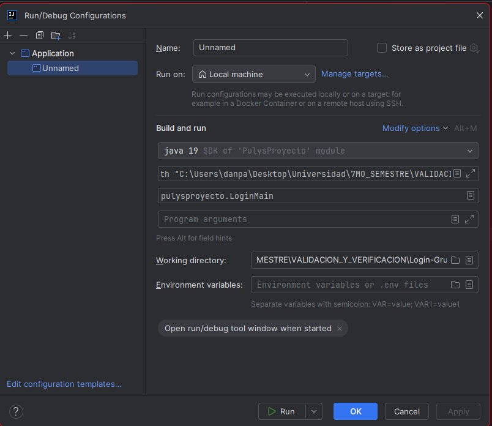
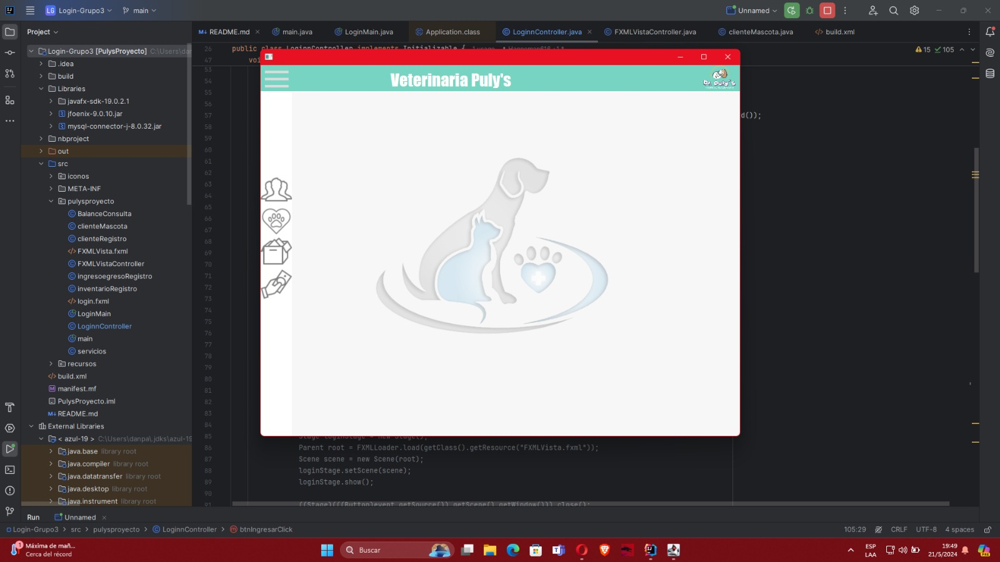
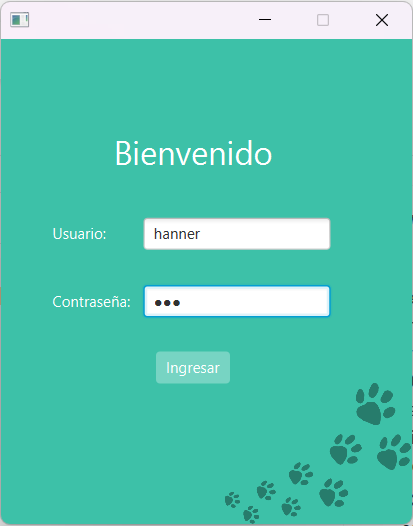
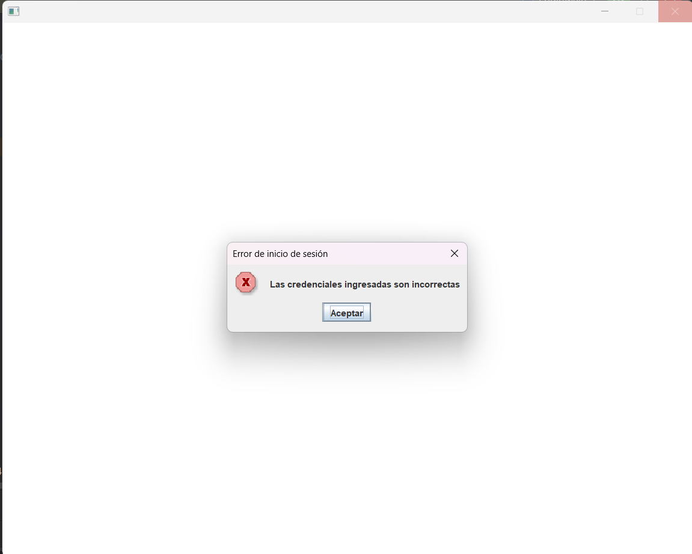
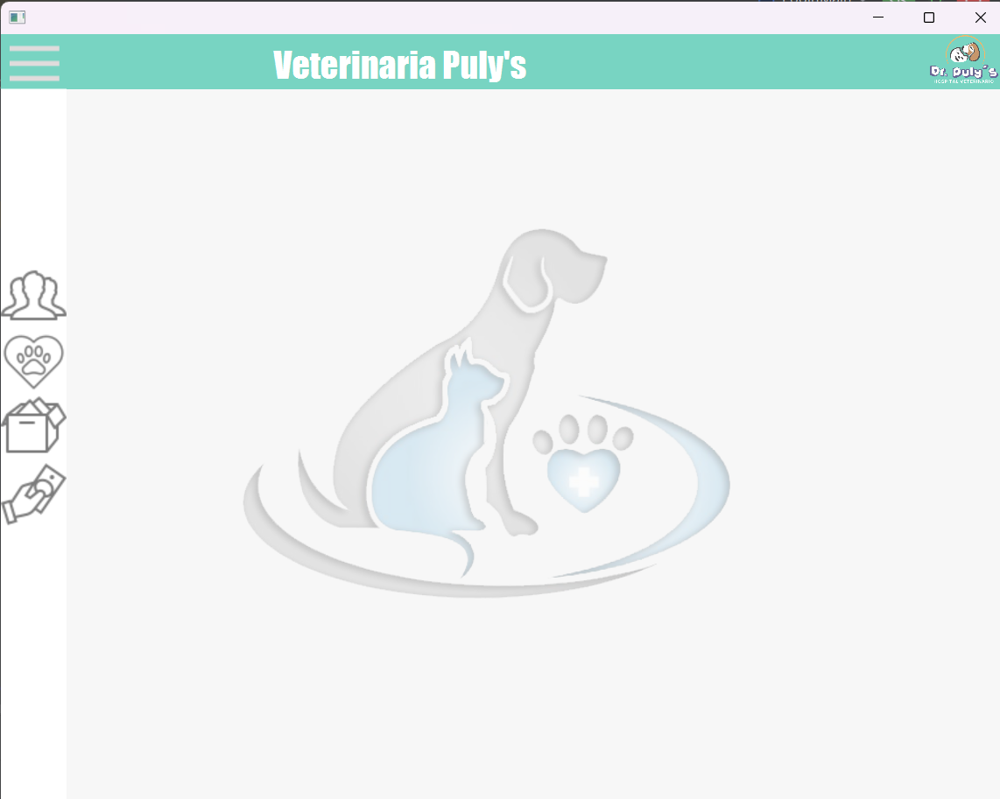

<h1 align="center">
    Escuela Politécnica Nacional<br>
    Facultad de Ingeniería en Sistemas<br>
    Verificación y Validación de Software<br>
</h1>

### Integrantes - Grupo 3

Nardy Cachipuendo  
Mateo Davalos  
Cristofer Paucar   
Juan Pablo Obregon  
Nathaly Simba

## Trabajo Login 

### Proceso previo a la ejecución del sistema

En caso de querer ejecutar el sistema se deben realizar los siguientes pasos. 

1. Buscar el Path correspondiente de su computadora que le lleve hasta la carpeta lib dentro del proyecto. En este caso particular es el siguiente: 

```
C:\Users\danpa\Desktop\Universidad\7MO_SEMESTRE\VALIDACION_Y_VERIFICACION\Login-Grupo3\Libraries\javafx-sdk-19.0.2.1\lib
```

2. Este path lo colocamos en el siguiente comando: 
```
--module-path "C:\Users\danpa\Desktop\Universidad\7MO_SEMESTRE\VALIDACION_Y_VERIFICACION\Login-Grupo3\Libraries\javafx-sdk-19.0.2.1\lib" --add-modules javafx.controls,javafx.fxml
```

3. El comando creado lo colocamos en la siguiente sección. Específicamente en la sección que se encuentra debajo de la selección de SDK.



4. Finalmente aplicamos los cambios y podremos ejecutar el programa sin problema. 

### Casos de Fallo

#### Caso de fallo 1 

En este caso de fallo podemos ver que deja acceder al sistema sin tener usuario y contraseña. Este error se presenta por falta de condicionamientos en el "if" respectivo. Como se observa en el código.

```java
if(user.equals(userBD) && password.equals(passwordBD)){
            try{
                Stage loginStage = new Stage();
                Parent root = FXMLLoader.load(getClass().getResource("FXMLVista.fxml"));
                Scene scene = new Scene(root);
                loginStage.setScene(scene);
                loginStage.show();

                ((Stage)(((Button)event.getSource()).getScene().getWindow())).close();
            }catch (Exception e){
            }
        }else{
            JOptionPane.showMessageDialog(null, "Las credenciales ingresadas son incorrectas", "Error de inicio de sesión", JOptionPane.ERROR_MESSAGE);
        }
```
### Ejecución:

Como podemos ver podemos acceder a la interfaz del sistema. 


Para poder solucionar en el código hemos comentado donde se encuentra el error



En el código que se encuentra en el repositorio podemos encontrar la solución a este problema

**Corrección del Código Caso de Fallo 1:**

La corrección recae en el de hecho de que cuando se envían campos vacíos no permite ingresar a la aplicación

Este problema detallado en el CASO FALLO 1 se soluciona al momento de colocar las condiciones correctas dentro del "if" respectivo, tal cual como se
muestra en el código funcional a continuación.

```java
if(user.equals(userBD) && password.equals(passwordBD) && !user.isEmpty() && !password.isEmpty()){
            try{
                Stage loginStage = new Stage();
                Parent root = FXMLLoader.load(getClass().getResource("FXMLVista.fxml"));
                Scene scene = new Scene(root);
                loginStage.setScene(scene);
                loginStage.show();
                ((Stage)(((Button)event.getSource()).getScene().getWindow())).close();

            }catch (Exception e){
            }
        }else{
            JOptionPane.showMessageDialog(null, "Las credenciales ingresadas son incorrectas", "Error de inicio de sesión", JOptionPane.ERROR_MESSAGE);
        }
```


#### Caso de fallo 2
El problema en el código está en la lógica del manejo del mensaje de error y la apertura de la nueva ventana. A pesar de que las credenciales sean correctas (es decir, `user.equals(userBD)` y `password.equals(passwordBD)` son verdaderos), el código aún muestra un mensaje de error de inicio de sesión. Esto se debe a que el `JOptionPane.showMessageDialog` para el mensaje de error está dentro del bloque `try`.

Veamos el código paso a paso:

1. **Validación de Credenciales Correctas:**
   ```java
   if(user.equals(userBD) && password.equals(passwordBD) && !user.isEmpty() && !password.isEmpty()){
   ```

   Esta línea verifica si las credenciales ingresadas (`user` y `password`) coinciden con las almacenadas en la base de datos (`userBD` y `passwordBD`), y también se asegura de que no estén vacías.

2. **Intento de Abrir la Nueva Ventana:**
   ```java
   try{
       Stage loginStage = new Stage();
       Parent root = FXMLLoader.load(getClass().getResource("FXMLVista.fxml"));
       Scene scene = new Scene(root);
       loginStage.setScene(scene);
       loginStage.show();
       JOptionPane.showMessageDialog(null, "Las credenciales ingresadas son incorrectas", "Error de inicio de sesión", JOptionPane.ERROR_MESSAGE);
       ((Stage)(((Button)event.getSource()).getScene().getWindow())).close();
   }catch (Exception e){
   }
   ```

   - Se crea una nueva `Stage` para la ventana de inicio de sesión.
   - Se carga el archivo FXML correspondiente y se establece la escena.
   - Se muestra la nueva ventana.
   - **Aquí está el error principal:** Justo después de mostrar la nueva ventana, el código muestra un `JOptionPane` con un mensaje de error diciendo que las credenciales son incorrectas, independientemente de que se haya logrado abrir la ventana correctamente.
   - Finalmente, se cierra la ventana actual (presumiblemente la ventana de inicio de sesión).

3. **Mensaje de Error para Credenciales Incorrectas:**
   ```java
   }else{
       JOptionPane.showMessageDialog(null, "Las credenciales ingresadas son incorrectas", "Error de inicio de sesión", JOptionPane.ERROR_MESSAGE);
   }
   ```

   Esta parte está bien, ya que muestra un mensaje de error si las credenciales no son correctas.
### Ejecución:
Se colocan las credenciales correctas

Se muestra el mensaje de error:

Sin embargo, al cerrar la ventana emergente se visualiza la pantalla principal del programa:


**Corrección del Código Caso de Fallo 2:**

El mensaje de error no debe mostrarse después de abrir la nueva ventana. Aquí está el código corregido:

```java
if(user.equals(userBD) && password.equals(passwordBD) && !user.isEmpty() && !password.isEmpty()){
    try{
        Stage loginStage = new Stage();
        Parent root = FXMLLoader.load(getClass().getResource("FXMLVista.fxml"));
        Scene scene = new Scene(root);
        loginStage.setScene(scene);
        loginStage.show();
        // No mostrar mensaje de error aquí, ya que las credenciales son correctas.
        ((Stage)(((Button)event.getSource()).getScene().getWindow())).close();
    }catch (Exception e){
        // Manejar la excepción si ocurre un error al cargar la nueva ventana.
        JOptionPane.showMessageDialog(null, "Ocurrió un error al abrir la nueva ventana", "Error", JOptionPane.ERROR_MESSAGE);
    }
}else{
    JOptionPane.showMessageDialog(null, "Las credenciales ingresadas son incorrectas", "Error de inicio de sesión", JOptionPane.ERROR_MESSAGE);
}
```

